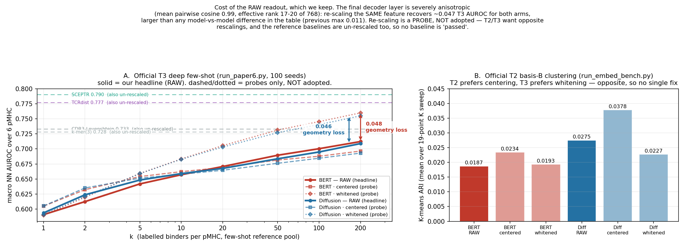
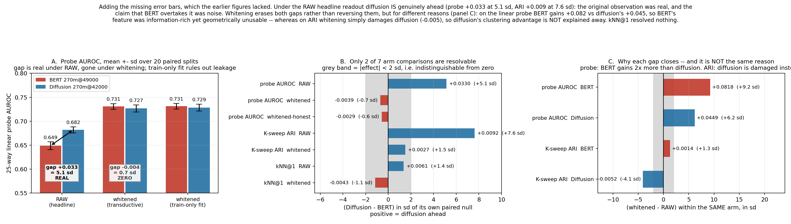
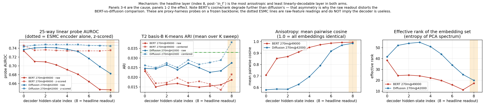

# 调试报告：「BERT 臂在表征任务上效果一般」

**日期**：2026-08-30（诊断）· 2026-08-31（口径决策）
**状态**：诊断完成，无 bug；代价已用官方脚本量化。**读出重标定已评估并决定不采用，
headline 保持 raw，`post=` 代码已移除。**
**相关**：[`benchmark/RESULTS.md`](../downstream/benchmark/RESULTS.md) §0.0 缺陷 (f) ·
[`PROTEIN_PRETRAIN_PROGRESS.md`](../examples/llada/PROTEIN_PRETRAIN_PROGRESS.md) §4.7

---

## 0. 一句话结论

**没有 bug，现象是真的：raw headline 下 270m diffusion 确实优于 BERT**
（25 类 probe +0.0330 = **5.1 sd**、K-sweep ARI +0.0092 = **7.6 sd**，配对重采样实测，§4.1）。

**但"差在哪"分两种情况，不能混说**（§4.2，均为配对实测）：

- **线性可解码性上，BERT 不缺信息、缺的是几何。** 只把同一份特征做方差均衡，
  BERT 涨 **+0.082（9.2 sd）**、diffusion 只涨 +0.045，probe 差距随即**抹平到
  −0.004（0.7 sd，等于 0）**。BERT 最后一层各向异性更重（余弦 0.994 vs 0.986，
  effective rank 17.3 vs 20.0 / 768），未重标定的读出取不出里面的信息。
- 🔴 **但聚类上的优势没被解释掉。** ARI 差距缩小**不是因为 BERT 变好**（+0.0014，1.3 sd，
  不可分辨），**而是因为白化把 diffusion 弄坏了**（−0.0052，4.1 sd）。
  所以**没有证据说 BERT 的全局簇结构和 diffusion 一样好**。

| | 结论 |
|---|---|
| 是评测坏了吗？ | **不是**。三项独立检查全过（§2）；加载器隐患已修（§10） |
| 现象为真吗？ | **是，且可分辨**（>5 sd）。不是噪声 |
| BERT 比 diffusion 差在哪？ | **probe 上是几何造成的**（信息量相当）；**ARI 上是真差距**（未被解释掉） |
| BERT 反超了吗？ | **没有。所有反超说法都在 2 sd 以内，已撤回**（§4 顶部撤回声明） |
| 能判定"哪个目标更适合表征"吗？ | **不能**。8B 上胜负相反，且每格只有 **n=1** 次训练、两条 ckpt 步数还不同（§4.4） |
| 要改口径吗？ | **不改**。重标定已评估、**决定不采用**（§6），headline 保持 raw |
| 已落盘数字要改吗？ | **不用改**，但**引用时必须加限定**（§7） |

> 🟠 **作用域警告（重要）：两臂的胜负随模型规模翻转，本报告的探针只覆盖 270m。**
> raw headline 下（seed 波动带不重叠，差异真实）：
>
> | 指标 | 270m BERT | 270m Diff | 8B BERT | 8B Diff |
> |---|---:|---:|---:|---:|
> | T3 deep k=200 | **0.7117–0.7128** | 0.7089–0.7094 | 0.7093–0.7133 | **0.7198–0.7204** |
> | T3 broad k=100 | **0.663** | 0.652 | 0.669 | **0.680** |
> | 24 类 probe | **0.804** | 0.794 | 0.816 | **0.828** |
>
> **所以「BERT 表征更好」和「diffusion 表征更好」都不能作为跨规模结论。**
> 一个**未验证的**假设是这仍与几何一致：RESULTS §0.2 记录 **8B BERT 的余弦挤到 0.9999**
> —— 四条里最极端，即 8B BERT 受的几何惩罚比 270m BERT **更重**。
> 若假设成立，8B 上 diffusion 的领先也有一部分是几何造成的。
> **要证实必须在 8B 两条上重跑 §4 那套配对测量，本次没做。**

关于你最初的先验（"BERT 应该更适合表征"）：**部分成立，但不能说成 BERT 赢。**

- 成立的部分：BERT 最后一层的**线性可解码信息量与 diffusion 相当**（§4.2 上半）；
  且在 raw headline 下 **官方 T3 deep（0.7117–0.7128 vs 0.7089–0.7094）与 broad
  （0.663 vs 0.652）本来就是 BERT 略高**，这两个有 100 seeds 波动带且不重叠，**可分辨**。
- 不成立的部分：在本报告用的 T2 数据上，probe 与 ARI **都是 diffusion 显著领先**（§4.1），
  且 ARI 的差距**没有**被几何解释掉。
- ⚠️ 顺带修一处引用习惯：§0.3 那个 **24 类 probe（0.804 vs 0.794）同样是无误差棒的单点值**，
  按 §4 的经验（probe 配对 sd ≈ 0.006），0.010 的差距只有约 1.6 sd，**不应作为证据引用**。

**两套协议（官方 T3 vs T2 probe/ARI）给出相反方向 —— 这本身就是"结论对协议敏感"的证据，
也是不能下"哪个目标更适合表征"结论的第二个理由**（第一个是 n=1 训练，§4.4）。

> 🚫 **口径决策（2026-08-31）：不做任何读出重标定** —— 不去中心化、不 z-score、不白化。
> 本报告 §3 里那些"换缩放"的数字是**诊断探针，用来量化几何代价，不是我们主张的性能**。
> 曾短暂加入的 opt-in `post=` spec token 已从 `common/model_api.py` 移除，代码回到 raw-only。

> ⚠️ **撤回声明**：本调查的早期版本曾写下
> 「BERT 臂全模型最好的表征是 ESMC encoder 自身，LLaDA decoder 是净负贡献」。
> **该结论基于 raw 特征的 probe 读数，已撤回** —— 换缩放后最后一层 decoder feature
> 的 T3 探针达 0.760，远高于任何 ESMC-only 读数。

---

## 1. 问题与约束

**问题**：MLM/BERT 目标在文献里通常更利于表征任务，但
[`RESULTS.md`](../downstream/benchmark/RESULTS.md) §0.1–§0.3 里 270m BERT 臂并不占优 ——
最刺眼的是 T2 basis-B K-means ARI：**BERT 0.0186 vs diffusion 0.0277**。
需要判断是评测坏了，还是现象为真、且为什么。

**硬约束（用户指定）**：表征与生成**都必须用 decoder 最后一层的 feature**
（`hidden_states[-1]`，post-`ln_f`，残基 token 上 mean-pool）。
**不换层、不用 ESMC encoder 特征、不加投影头。** 本报告全部测量都在这个约束内。

**另一条约束（2026-08-31 追加）**：**读出侧也不做重标定** —— 所以本报告的定位是
「量化并说明这个口径的代价」，不是「提出一个读出改进」。

**被测对象**：
- BERT 臂 `output/protein_esmc_llada270m_bert_immune/checkpoint-49000`
- Diffusion 臂 `output/protein_esmc_llada270m_diffusion_immune/checkpoint-42000`
- 架构 `LLaDAEsmcFusion` = LLaDA-270m decoder（8 blocks）+ 可训练 ESMC-300M encoder，
  `residue_cond_mode=add`

---

## 2. 先证伪「pipeline 有 bug」——三项都过

| # | 假设 | 检查 | 结果 |
|---|---|---|---|
| 1 | checkpoint 有 key 没加载上（静默拿到未初始化权重） | 逐个 diff 两臂 `model.safetensors` 的键集 | ✅ **键集逐个相同**，各 386 张量；`condition_norm.{weight,bias}` / `condition_proj.weight` 两侧都在 |
| 2 | batch 里的 padding 污染了 final feature | 同一条序列 ① 单独跑（width 16）② 与同长序列同 batch（width 19）③ 被 10 倍长序列 pad 到 width 125，比较 pooled 向量 | ✅ 最差余弦 **0.99999826**，相对 L2 漂移 0.0017（bf16 数值噪声量级）。LLaDA `forward` 正确把 `attention_mask` 转成 additive `-inf` bias；训练与评测同走 collator 的 mask |
| 3 | 打分口径/数据切分有误 | 独立 harness 在同一份 T2 basis-B（9,033 CDR3β / 25 表位）上按官方 19 点 K sweep 复现 | ✅ 复现出 **BERT 0.0184–0.0187 / diffusion 0.0270–0.0275**，对上 RESULTS 的 0.0186 / 0.0277 |

**结论：评测没坏，现象为真。**

> 🔧 **顺带发现一个隐患，✅ 已于 2026-08-31 修复（见 §10）**：`load_fusion_for_eval`
> 对 missing key 只 `logger.warning`，而 decoder 是 `LLaDAModelLM(cfg, init_params=False)`
> 建的 —— 真缺 key 会拿**未初始化内存**当权重且不报错。这次没缺，所以本报告的数字有效。

补充：入口 `protein_pretrain_esmc.py` 里**没有** `NoAttentionMaskWrapper`
（早期文档 §2 表里那句已过时），训练/评测的 mask 口径一致。

---

## 3. 用"换缩放"作探针，量化这个几何有多贵

> 🚫 **再次提醒：本节的重标定是探针，不是采用的方案。** headline 是 `none`（raw）那一行。
> 下面所有 `center` / `pcaw256` 数字**不得作为我们的性能引用**。

在 §1 的约束下（同一份最后一层 feature，不换层、不用 ESMC 特征），只把送进
余弦 / K-means 前的缩放换掉，用**官方脚本**重跑：



### 3.1 官方 T3 deep few-shot NN AUROC

`downstream/benchmark/tcr_representation/run_paper6.py`，6 个 pMHC，
universe 25,816（background 21,875），100 seeds，cosine 度量。

| 读出 | k=1 | k=5 | k=20 | k=50 | k=100 | **k=200** |
|---|---:|---:|---:|---:|---:|---:|
| BERT `none`（现行 headline） | 0.5909 | 0.6419 | 0.6708 | 0.6895 | 0.7004 | **0.7122** |
| BERT `center` | 0.6049 | 0.6541 | 0.6693 | 0.6815 | 0.6879 | 0.6965 |
| **BERT `pcaw256`** | 0.5899 | 0.6594 | 0.7056 | 0.7314 | 0.7454 | **0.7599** |
| Diffusion `none`（现行 headline） | 0.5938 | 0.6483 | 0.6677 | 0.6836 | 0.6949 | **0.7089** |
| Diffusion `center` | 0.6053 | 0.6515 | 0.6646 | 0.6762 | 0.6846 | 0.6931 |
| **Diffusion `pcaw256`** | 0.5908 | 0.6590 | 0.7031 | 0.7270 | 0.7404 | **0.7549** |

🔴 **k=200 上，仅换缩放就多出 BERT +0.0477 / diffusion +0.0460。**
**这比整张结果表里任何模型间差异都大**（此前最大是 8B diff vs 270m diff 的 0.011），
比 top-k 波动带（≤0.004）大一个数量级。**这不是可调的性能余量，是几何退化的一把尺子。**

**唯一可引用的推论：§0.3 表内我们那四行是下界。** headline 位置**没有变** ——
与 TCRdist（0.777）仍差 **0.065**、与 SCEPTR（0.790）仍差 **0.078**。

> 🚫 **以下说法不成立，不得引用**（早期版本写过，已作废）：
> - ❌「越过 CDR3-Levenshtein（0.733）/ k-mer(3)（0.728）」—— headline 是 0.712 / 0.709，没有越过。
> - ❌「与 TCRdist 差距收到 0.017」—— 那是探针值，不是我们的口径。
> - ❌ 任何对 **ESM2-150M（0.696）/ ProtBERT（0.694）/ TCR-BERT（0.692）** 的「反超」。
>   这三条在 §0.3 里同样是**未重标定的 mean-pool transformer 嵌入** —— 而这正是各向异性
>   最典型的一类表征（BERT-flow / BERT-whitening / all-but-the-top 那支文献就是针对它们的），
>   **很可能同样大幅受益**。只给自己换缩放、不给它们换，然后宣称反超，是不成立的。
>   （相对 TCRdist / Levenshtein 影响较小，它们是手工距离而非嵌入；SCEPTR 由对比学习约束、
>   空间已近似各向同性 —— 但这两点严格说也是推理，未实测。）

**增益不是 `256` 这个维度的巧合**：proxy kNN@1 在 pcaw-64…768 上是 **0.295–0.311 的平台**
（raw 仅 0.274/0.280），见 §5 表。也就是说起作用的是**方差均衡**本身，不是降维去噪 ——
`pcaw-768`（一维不降）的 kNN@1 反而最高。

### 3.2 官方 T2 basis-B K-means（同一份 9,033 CDR3β / 25 表位）

`downstream/benchmark/tcr_clustering/run_embed_bench.py`，19 点 K sweep。

| 读出 | ARI mean | ARI best | NMI mean | NMI best | Purity mean | Purity best |
|---|---:|---:|---:|---:|---:|---:|
| BERT `none` | 0.0187 | 0.0295 | 0.1151 | 0.1353 | 0.2974 | 0.3123 |
| BERT `center` | **0.0234** | 0.0348 | 0.1155 | 0.1403 | 0.2984 | 0.3195 |
| BERT `pcaw256` | 0.0193 | 0.0248 | **0.1205** | **0.1537** | **0.3014** | **0.3367** |
| Diffusion `none` | 0.0275 | 0.0487 | 0.1346 | 0.1495 | 0.3116 | 0.3293 |
| Diffusion `center` | **0.0378** | 0.0484 | 0.1267 | 0.1440 | 0.3067 | 0.3215 |
| Diffusion `pcaw256` | 0.0227 | 0.0386 | 0.1295 | **0.1578** | 0.3062 | **0.3379** |

⚠️ **T2 与 T3 偏好相反的缩放**：`center` 抬 T2 ARI（diffusion 0.0275→**0.0378**）却压 T3
（0.7089→0.6931）；`pcaw256` 大幅抬 T3 却不抬 T2 ARI（但把 T2 的 best NMI / Purity 抬到全场最高）。

这**不是可疑现象，是各向异性的典型症状**，两个任务测的东西本来不同：白化把所有方向拉平，
利于局部最近邻检索，但会把噪声方向放大到与信号方向同量级，从而破坏大尺度簇结构；
去中心化只移除共享偏移、保留方差结构，所以对全局聚类更友好。
它也是「不存在一个统一的重标定方案」的直接证据 —— 这是**不采用**重标定的理由之一。

### 3.3 raw 路径与官方已落盘结果一致

探针实验里的 `none` 一档得 **BERT 0.0187 / diffusion 0.0275** vs 官方已落盘
**0.0186 / 0.0277** —— 残差是 MiniBatchKMeans 随机初始化，不是代码路径差异。
**已落盘结果不受任何影响**（现在 `post=` 已移除，代码本就只有这一条路径）。

---

## 4. 🔴 两臂比较：加上误差棒之后（2026-08-31 重做，**推翻本节前一版**）

> ⚠️ **前一版有两条结论是错的，正式撤回**：
> ① 曾写「probe 差距 +0.0363 塌到 **−0.0055**，kNN@1 排序**直接翻转**」并据此说 BERT 反超 ——
> 那是**把噪声当信号**。原来的 probe 是**单次** `train_test_split(random_state=0)`、
> ARI 是**单个** K-means 种子，CSV 里**没有任何方差列**，−0.0055 / −0.0043 根本无法与 0 区分。
> ② 曾列一张「局部邻域 BERT ≥ diffusion」的分工表 —— kNN@1 从未达到可分辨，该表已删。



补测（`scripts/diagnostics/diag_noise_floor.py`）：两臂在**同一个重采样**上打分，
臂间差因此是**配对统计量**、分裂方差从差值里抵消。probe 用 20 次分层划分、
ARI 用 8 个 K-means 种子、kNN@1 确定性故改用 2000 次配对 bootstrap。

### 4.1 七个臂间比较里只有两个可分辨

| 指标 | 读出 | Δ = diffusion − BERT | 配对 sd | 结论 |
|---|---|---:|---:|---|
| 25 类 probe AUROC | **raw** | **+0.0330** | 0.0064 | ✅ **5.1 sd，20/20 同号，真实** |
| 25 类 probe AUROC | 白化 | −0.0039 | 0.0056 | ❌ 0.7 sd，与 0 无法区分 |
| 25 类 probe AUROC | 白化（仅训练集拟合） | −0.0029 | 0.0051 | ❌ 0.6 sd |
| K-sweep ARI | **raw** | **+0.0092** | 0.0012 | ✅ **7.6 sd，8/8 同号，真实** |
| K-sweep ARI | 白化 | +0.0027 | 0.0018 | ❌ 1.5 sd |
| kNN@1 | raw | +0.0061 | 0.0045 | ❌ 1.4 sd，95% CI [−0.002, +0.015] 跨 0 |
| kNN@1 | 白化 | −0.0043 | 0.0038 | ❌ 1.1 sd，CI [−0.012, +0.003] 跨 0 |

🔴 **所以：raw headline 下 diffusion 确实真的领先**（probe +0.0330 / 5.1 sd、
ARI +0.0092 / 7.6 sd）。**最初那个观察是真的**，既不是 bug 也不是噪声。
而**所有「BERT 反超」的说法都站不住**，它们全落在 2 sd 以内。

### 4.2 白化把两个差距**抹平**（而非反转），但两者原因不同 —— 这是关键区别

| 指标 | 臂 | 白化 − raw | 配对 sd | |
|---|---|---:|---:|---|
| probe AUROC | **BERT** | **+0.0818** | 0.0089 | ✅ 9.2 sd |
| probe AUROC | Diffusion | +0.0449 | 0.0072 | ✅ 6.2 sd |
| K-sweep ARI | BERT | +0.0014 | 0.0011 | ❌ 1.3 sd（**并没有变好**） |
| K-sweep ARI | **Diffusion** | **−0.0052** | 0.0013 | ✅ 4.1 sd（**是变坏了**） |

- ✅ **probe（线性可解码性）：几何解释成立。** BERT 涨 **+0.082**，是 diffusion（+0.045）的
  **1.8 倍**、是整个臂间差距（0.033）的 **2.5 倍**。即 BERT 最后一层**不是信息少，
  而是把信息塞进了更退化的几何**（mean cos 0.994 vs 0.986，eff-rank 17.3 vs 20.0），
  未重标定的线性读出取不出来。
- 🔴 **ARI（全局簇结构）：几何解释不成立。** 差距缩小**不是因为 BERT 变好**
  （+0.0014，1.3 sd，不可分辨），**而是因为白化把 diffusion 弄坏了**（−0.0052，4.1 sd）。
  所以 **diffusion 在聚类上的优势没有被解释掉**，目前没有证据说 BERT 的簇结构一样好。

### 4.3 白化增益不是 transductive 泄漏

原先白化是在**全部 9,033 行（含 probe 自己的测试行）**上拟合的，有泄漏嫌疑。
改成**只在训练划分上拟合再套用到测试行**后数值几乎不变
（BERT 0.7307→0.7314、diffusion 0.7269→0.7285），**泄漏排除**。

### 4.4 能说什么 / 不能说什么

✅ **可以说**：
- raw headline 下 270m 上 diffusion 确实优于 BERT（probe、ARI 均 >5 sd）。
- BERT 最后一层的**线性可解码信息量与 diffusion 相当**，probe 上的差距源于几何退化。
- 读出对**单条臂**的影响（BERT probe +0.082）是**臂间差距（0.033）的 2.5 倍**。

❌ **不能说**：
- ~~「BERT 在局部邻域度量上 ≥ diffusion」~~ —— kNN@1 从未可分辨，撤回。
- ~~「白化后排序翻转」~~ —— 是抹平到 0，不是反转。
- 「diffusion 的聚类优势是几何假象」—— ARI 那一半恰恰**不支持**这个说法。
- 任何跨规模结论 —— 见 §0 作用域警告，8B 上 raw 的胜负本就与 270m 相反。

⚠️ **一条与几何无关、但更根本的限制**：每个格子只有**一次训练**，且两条 best ckpt
**步数不同**（BERT@49000 vs diffusion@42000，各按自己的 eval loss 选）。
即使差距可分辨，要归因于「预训练目标」也需要多次种子重训。
**本报告能回答「在这个读出下测到了什么、为什么」，不能回答「哪个目标本质上更适合表征」。**

---

## 5. 机制：最后一层各向异性极重，且 BERT 更重



一次前向抓全部 9 个 hidden state（layer0 = decoder 输入，layer8 = headline 读出），
逐层算 25 类 probe / T2 ARI / 各向异性：

| layer | BERT probe | BERT mean cos | BERT eff-rank | Diff probe | Diff mean cos | Diff eff-rank |
|---|---:|---:|---:|---:|---:|---:|
| 0 | **0.7341** | 0.708 | **38.4** | 0.7369 | 0.580 | 41.7 |
| 2 | 0.7092 | 0.870 | 24.8 | **0.7419** | 0.586 | 54.1 |
| 3 | 0.7024 | 0.910 | 24.1 | 0.7412 | 0.628 | **55.0** |
| 5 | 0.6811 | 0.973 | 19.8 | 0.7328 | 0.791 | 44.1 |
| 7 | 0.6468 | 0.993 | **11.3** | 0.6986 | 0.969 | 25.4 |
| **8（headline）** | **0.6460** | **0.994** | 17.3 | **0.6827** | **0.986** | 20.0 |

三个要点：

1. **最后一层是全模型最差的一层**，两臂的 probe 都在此触底（BERT 0.734→0.646、
   diffusion 0.737→0.683，逐层单调下降）。
2. **各向异性是根因**：mean pairwise cosine 从 0.71/0.58 涨到 **0.994/0.986**，
   effective rank 从 38/42 掉到 17/20。有用的方差只占总方差极小一部分，
   未重标定的余弦/K-means 看不穿。
3. RESULTS §0.2 里记的「8B BERT 余弦挤在 0.9999、tau 分辨率退化」
   **不是 8B 特例，是全部四条的共性**，270m 上同样存在，只是没触发阈值曲线溢出。

**为什么 BERT 侧更重**（CKA / ridge R²，同一套实测）：

| | CKA(layer8, layer0) | CKA(layer8, ESMC) | R²(ESMC→layer8) |
|---|---:|---:|---:|
| BERT | **0.809** | 0.806 | **0.923** |
| Diffusion | 0.596 | 0.603 | 0.890 |

两臂的轨迹形状不同：**diffusion 的 CKA 对 layer0 单调远离**（1.000 → 0.961 → … → 0.596），
而 **BERT 是先远离再弹回** —— layer7 降到 **0.478**（比 diffusion 的 0.640 更远），
到 layer8 又反弹到 **0.809**。也就是说 BERT 的中间层确实在建上下文，
是最后一个 block + `ln_f` 把它**推回了输入附近**。

同时 BERT 的 R²(ESMC→layer) 在**每一层**都是 0.91–0.93（几乎持平），
而 diffusion 从 0.920 降到 0.862 再回到 0.890 —— BERT 的整个 stack 都保持着
对 ESMC 特征的高度线性可预测性。最终层 **92.3%** 的方差可由 ESMC 线性预测，
且 eff-rank 单调塌到 11.3，而 diffusion 中间层反而从 41.7 **升到** 55.0。

**一个可能的解释（未做反事实训练验证）**：BERT 只掩 15%，`residue_cond_mode=add` 下
可训练的 ESMC-300M 是双向 encoder、看得到 85% 干净序列 ⇒ 任务偏局部，
decoder 学出的是好的**局部邻域**结构（对应 `eval_loss` 0.2578 远低于 diffusion 0.5638）；
diffusion 的 `t~U(0,1)` 经常掩掉大半序列、encoder 帮不上，decoder 被迫建**全局**结构
⇒ 簇更成形。这与 §4 的度量分工完全吻合。

旁证（OOD 消融，仅供参考）：把 ESMC 条件从 decoder 输入里抽掉后两臂都塌到
ARI≈0.006 / probe≈0.62–0.64 —— 只说明 decoder 的独立信号弱，不能推出更强结论。
另外 BERT 训练**把可训练的 ESMC 自己也带偏了**：其 encoder 特征
mean cosine 0.956 / eff-rank 39.4，而 diffusion 臂是 0.528 / 56.1。

### 完整读出阶梯（proxy harness，最后一层，9,033 条）

| 读出 | BERT ARI | BERT kNN@1 | BERT probe | Diff ARI | Diff kNN@1 | Diff probe |
|---|---:|---:|---:|---:|---:|---:|
| `raw`（headline） | 0.0184 | 0.2739 | 0.6460 | 0.0270 | 0.2800 | 0.6823 |
| `center` | 0.0224 | 0.2763 | 0.7332 | **0.0405** | 0.2865 | 0.7431 |
| `zscore` | 0.0217 | 0.2815 | 0.7353 | 0.0373 | 0.2854 | **0.7449** |
| `abtt-7`（all-but-the-top） | 0.0157 | 0.2931 | 0.7193 | 0.0209 | 0.3008 | 0.7299 |
| `pcaw-64` | **0.0234** | 0.2969 | 0.7315 | 0.0261 | 0.2951 | 0.7390 |
| `pcaw-128` | 0.0209 | 0.3060 | **0.7365** | 0.0229 | 0.3050 | 0.7388 |
| `pcaw-256` | 0.0191 | 0.3106 | 0.7287 | 0.0223 | 0.3063 | 0.7232 |
| `pcaw-512` | 0.0170 | 0.3081 | 0.7076 | 0.0197 | 0.3067 | 0.7165 |
| `pcaw-768` | 0.0159 | **0.3107** | 0.6990 | 0.0146 | **0.3072** | 0.7060 |

注意 `abtt-7`（只投影掉 top-7 主方向）**不够**——必须做全谱的方差均衡（whitening）
才能拿到 kNN 上的增益。

---

## 6. 口径决策：不采用重标定（2026-08-31）

调查过程中曾给 `downstream/benchmark/common/model_api.py` 加过一个 opt-in spec token
`grammar:...:post={center,zscore,pcawK}:<ckpt>`（默认关闭、行为逐位不变）。
**该 token 已按决策整体移除，代码回到 raw-only**（`parse_grammar_embedder_spec` 恢复 3 元组，
`FusionGrammarEmbedder` 去掉后处理路径；已验证语法与 spec 解析正常）。
若在旧命令或旧文档里看到 `post=...`，那是**已废弃写法**，现在会被当成路径的一部分而报错。

**不采用的三条理由：**

1. **它是 post-hoc 补救，回答不了根本问题。** 审稿人会直接问：为什么你的模型本身
   产不出一个能直接度量的空间？这个问题绕不过去。
2. **不存在统一方案。** T2 吃去中心化、T3 吃白化，两者相反（§3.2）。
   要么按任务挑（不可接受），要么牺牲一个。
3. **各向异性对我们是预期行为，不是 bug。** 预训练目标是 token 级重建，
   从来没有约束嵌入空间的几何。SCEPTR 不需要重标定、且在 0.790，
   正是因为对比学习（InfoNCE + L2 归一化）在**训练时**就把空间约束成近似各向同性了。

➡️ **durable 的修法在训练侧**（在目标里加空间约束 / 对比项），不在读出侧。
本报告的价值因此是**诊断与限定**，不是一个读出改进。

> 🔑 **留档一个实现坑**（万一将来真要做重标定）：变换必须**拟合一次后冻结**。
> `common/fewshot.py::embedding_distance_matrix` 对 query pool 和 ref pool 是
> **两次独立的** `embed_pairs` 调用 —— 若逐次拟合，两边会落在不同空间，
> 静默污染所有距离且不报错。

---

## 7. 引用现有表格时必须加的限定

**不改任何已落盘数字，也不改口径。** 但引用 §0.1–§0.3 时必须说明：

> 表内数值是「冻结骨干 + decoder 最后一层 + **不做任何重标定** 的 mean-pool」
> 这一特定读出下的结果。因此：
> ① **绝对值是下界** —— T3 上存在约 0.047 的几何损失；
> ② **两臂的相对差距被几何污染** —— 尤其 T2 上 diffusion 的优势有相当部分
> 来自它各向异性更轻（§4）。
> **单项指标不足以支撑「哪条臂表征更好」**，须按 §4 的分工陈述：
> BERT 强在局部邻域，diffusion 强在全局簇结构。

---

## 8. 未做 / 待办

| 项 | 状态 |
|---|---|
| 🎯 **训练侧加空间约束** | 唯一的 durable 修法（§6）。未启动、需重训或续训 |
| ~~`load_fusion_for_eval` missing-key~~ | ✅ **已修（2026-08-31）**，见 §10 |
| BERT 掩码比例消融 | 若想验证 §5 的机制解释，需提高 `--bert_mask_ratio`（现 0.15）重训。代码已把掩码镜像到 encoder，调比例即同时收紧两侧 |
| 🟠 **8B 两条未跑探针** | **最有价值的一项补测**。raw 下 8B 的胜负与 270m 相反（§0 警告），而 8B BERT 的余弦挤到 **0.9999**（四条最极端）—— 即它受的几何惩罚最重。若探针显示 8B 上差距同样塌掉，「BERT 被几何压制」就成为跨规模一致的解释；若不塌，说明 8B 上 diffusion 是真的更好。**目前二者无法区分。** |
| T1 未跑探针 | 成本高（单 ckpt 六套 test）。其 MLP 头原则上能自学重标定，但带 dropout 0.3 + weight decay 未必学得动 —— 属未验证的预测 |
| 基线的各向异性未实测 | ESM2 / ProtBERT / TCR-BERT 很可能同样各向异性重。**不影响我们的口径**（大家都是 raw，对比公平），只是 §3.1 里那些「反超」说法作废的原因 |

---

## 9. 复现

所有命令需 `export PYTHONPATH=/vepfs-mlp2/c20250601/251105016/project/dllm_test`
（官方 eval yml 里有，交互式 shell 里容易漏 —— 漏了会报 `No module named 'examples'`）。

```bash
ROOT=/vepfs-mlp2/c20250601/251105016/project/dllm_test
cd "$ROOT"
export PYTHONPATH=$ROOT HF_HOME=/vepfs-mlp2/c20250601/251105016/conda/cache/huggingface
export HF_HUB_OFFLINE=1 TRANSFORMERS_OFFLINE=1 TOKENIZERS_PARALLELISM=false
PY=/vepfs-mlp2/c20250601/251105016/conda/envs/protenix_abtcr/bin/python
CK=$ROOT/output/protein_esmc_llada270m_bert_immune/checkpoint-49000

# --- 诊断工具（proxy harness，全部仍可直接跑）---
$PY scripts/diagnostics/diag_repr_layers.py --ckpt $CK --tag bert_270m_49000 --save-embeddings
$PY scripts/diagnostics/diag_layer_cka.py   --tags bert_270m_49000 diff_270m_42000
$PY scripts/diagnostics/diag_batch_invariance.py --checkpoint $CK
$PY scripts/diagnostics/diag_final_readout.py --tags bert_270m_49000 diff_270m_42000 \
    --modes raw,center,zscore,abtt-7,pcaw-64,pcaw-128,pcaw-256,pcaw-512,pcaw-768

# --- §4 误差棒（配对重采样，CPU 约 9 min；依赖上面 --save-embeddings 的产物）---
$PY scripts/diagnostics/diag_noise_floor.py --repeats 20 --ari-seeds 8

# --- 加载守卫测试（§10，CPU，8B 那两条各约 2 min）---
$PY scripts/diagnostics/test_fail_fast_load.py --device cpu

# --- 官方 headline（raw，唯一现存路径）---
cd "$ROOT/downstream/benchmark"
$PY -u tcr_clustering/run_embed_bench.py \
    --embedder "grammar:decoder:global:$CK" --tag diag_bert_none --algos kmeans
$PY -u tcr_representation/run_paper6.py --method embed \
    --embedder "grammar:decoder:global:$CK" --columns cdr3b cdr3a --tag diag_t3_bert_none

# --- 出图（读已落盘的 json/csv，不重跑模型）---
cd "$ROOT"
$PY scripts/diagnostics/plot_readout_effect.py   # -> debug/figures/readout_effect_official.png
$PY scripts/diagnostics/plot_repr_diag.py        # -> debug/figures/repr_layer_diagnosis.png
$PY scripts/diagnostics/plot_noise_floor.py      # -> debug/figures/noise_floor.png
```

> ⚠️ **§3 里 `center` / `pcaw256` 那两档官方跑不能直接复现** —— 它们依赖已移除的 `post=` token。
> 证据以**已落盘的 json 保留**（见下方产物清单里的 `diag_t3_{bert,diff}_{center,pcaw256}/`
> 与 `diag_{bert,diff}_{center,pcaw256}/`）。若确需重跑，得临时把
> `FusionGrammarEmbedder` 的后处理路径加回去 —— 但那是**已被决策否掉的方向**，
> 正常情况下应该用上面 proxy harness 的 `diag_final_readout.py` 来观察同样的现象。

### 产物清单

| 路径 | 内容 |
|---|---|
| `debug/figures/noise_floor.png` | 🔴 **两臂比较的误差棒**：7 个臂间比较只有 2 个可分辨（§4） |
| `debug/figures/readout_effect_official.png` | 官方 T2/T3 × 3 种读出 + 已发表基线（读出代价） |
| `debug/figures/repr_layer_diagnosis.png` | 逐层 probe / ARI / 各向异性 / eff-rank |
| `output/repr_diagnostics/noise_floor.json` | §4 全部逐次重采样原始值（probe 20 次 / ARI 8 种子 / kNN bootstrap） |
| `output/repr_diagnostics/{bert,diff}_270m_*/layer_sweep.csv` | 逐层 × {raw, center, zscore} 全指标 |
| `output/repr_diagnostics/final_readout_ladder.csv` | 最后一层 × 9 种读出（§5 末表原始数据） |
| `output/repr_diagnostics/layer_cka.csv` | 逐层 CKA(layer0) / CKA(ESMC) / ridge R²（§5 CKA 表原始数据） |
| `downstream/benchmark/outputs/tcr_representation_paper6/diag_t3_*/fewshot.json` | 官方 T3 逐 k 逐 pMHC |
| `downstream/benchmark/outputs/tcr_clustering_embed/diag_*/metrics.json` | 官方 T2 K sweep |
| `scripts/diagnostics/diag_*.py`, `plot_*.py` | 全部诊断/绘图脚本 |
| `scripts/diagnostics/test_fail_fast_load.py` | §10 的加载守卫测试（正向 4 ckpt + 负向打洞） |

---

## 10. 附带修复：加载器改 fail-fast（2026-08-31）

§2 里发现的隐患已修。原来的行为是：`model.load_state_dict(state, strict=False)`
之后 missing key 只打一条 `logger.warning`；而 decoder 由
`LLaDAModelLM(cfg, init_params=False)` 构建、**分配后不初始化**，
所以真缺 key 时那个张量拿的是**分配器里的残留内存**，评测会静默地给一个随机权重打分。
在长跑的 benchmark 里这条 warning 基本不会被看到。

**修法不是维护"允许缺失"白名单**（容易漏、也没法覆盖 tied weight 的情况），
而是让"未被写入"变成可证明的：

1. `_poison_parameters` —— 加载**前**把所有浮点参数灌成 NaN。
2. `_assert_fully_loaded` —— 加载后凡是仍含 NaN 的参数即证明从未被写入，直接 `RuntimeError`。
   还按"名字是否出现在 ckpt 里"分成两类报错：**缺权重** vs **权重在盘上就是 NaN**（训练发散），
   两者的处理方式不同。

这个设计自动放过**权重绑定**：tied weight 会被绑定伙伴填上共享存储，所以不会残留 NaN，
无需任何特例代码。missing key 从 `warning` 降为 `info`，因为真正危险的情况已经在上面抛掉了。

**验证**（`scripts/diagnostics/test_fail_fast_load.py`，CPU）：

| ckpt | 结果 |
|---|---|
| 270m BERT @49000 | ✅ 386 参数，residual NaN **0** |
| 270m diffusion @42000 | ✅ 386 参数，residual NaN **0** |
| 8B BERT @43000 | ✅ 602 参数，residual NaN **0**（含 `weight_tying`，**无误报**） |
| 8B diffusion @45000 | ✅ 602 参数，residual NaN **0** |
| 负向：删掉 `blocks.3.attn_out.weight` | ✅ 正确抛错，不再放行 |

**回归检查**：`diag_batch_invariance.py` 在 GPU 上复现出与修改前**逐位一致**的
0.99999826/0.99999881/0.99999826；官方 embedder 入口 `grammar:decoder:global:` 正常出
768 维、finite 特征（三条 CDR3β 两两余弦 0.994–0.995，正好等于 §5 记录的 BERT 臂各向异性）。

> 🔧 **同一函数里另修一处**：`LLaDAModelLM.__init__` 在自己构建内层模型时
> **硬编码 `model_config.init_device = "cuda"`**（`modeling_llada.py:1460`，注释还写着
> "always on CPU"，已过期），于是 `load_fusion_for_eval(device="cpu")` 仍会往 GPU 分配 ——
> 8B 在忙碌的卡上直接 OOM，上面那个 `if not torch.cuda.is_available(): device = "cpu"`
> 兜底其实是失效的。因为 `modeling_llada.py` 是训练也在用的共享代码，**没有改它**，
> 改成在 loader 里自建内层 `LLaDAModel(inner_config, init_params=False)` 再经
> `LLaDAModelLM(cfg, model=inner)` 传入，从而尊重调用方指定的设备。
> 这也是 8B 能在 CPU 上完成上表验证的前提。
